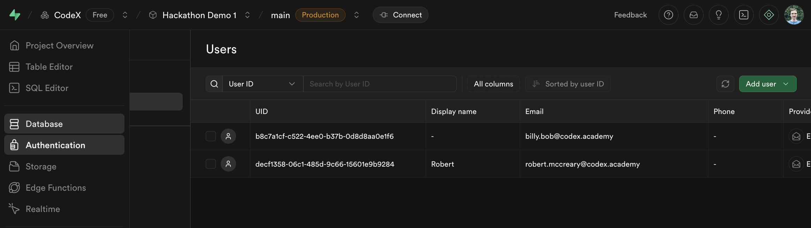
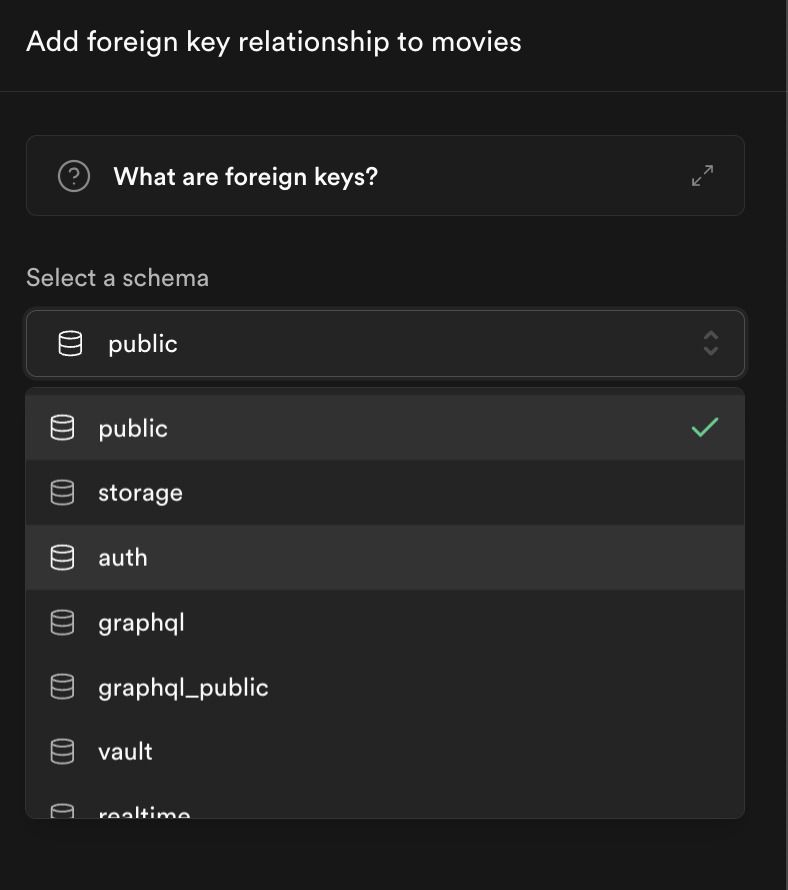
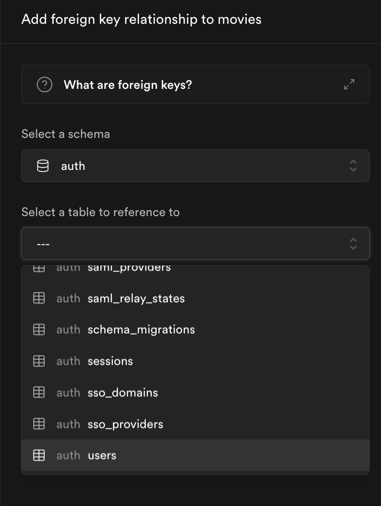
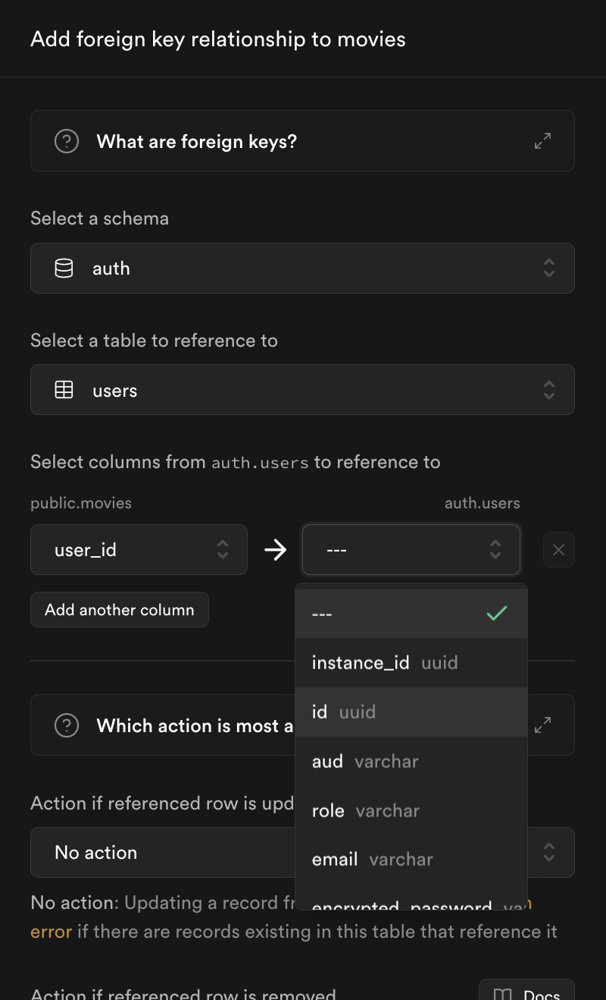
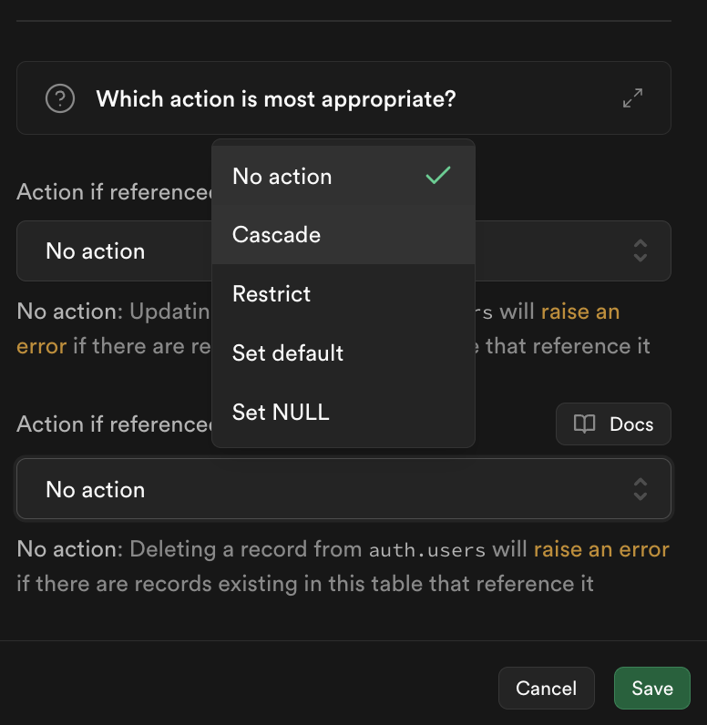
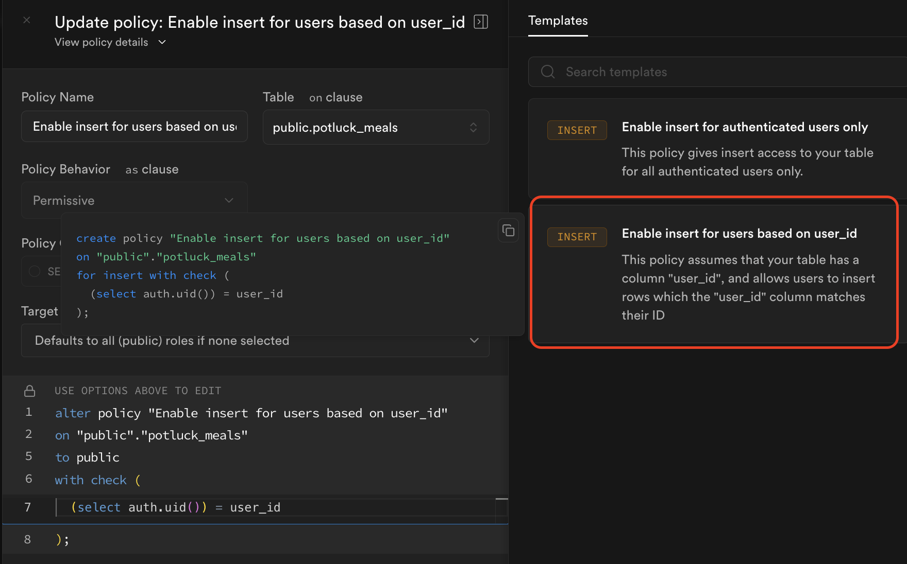
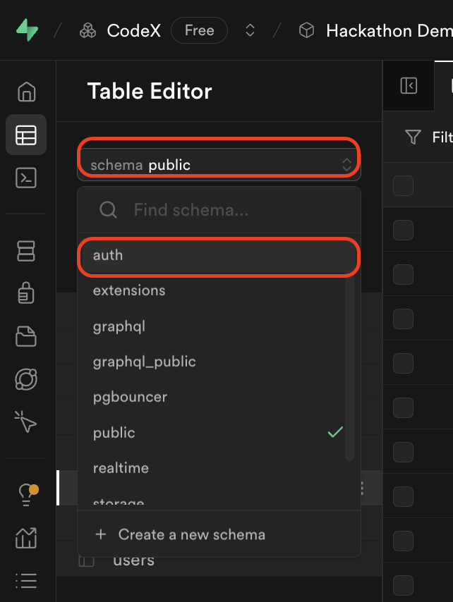
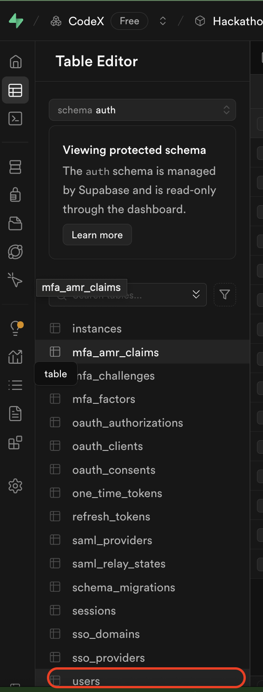
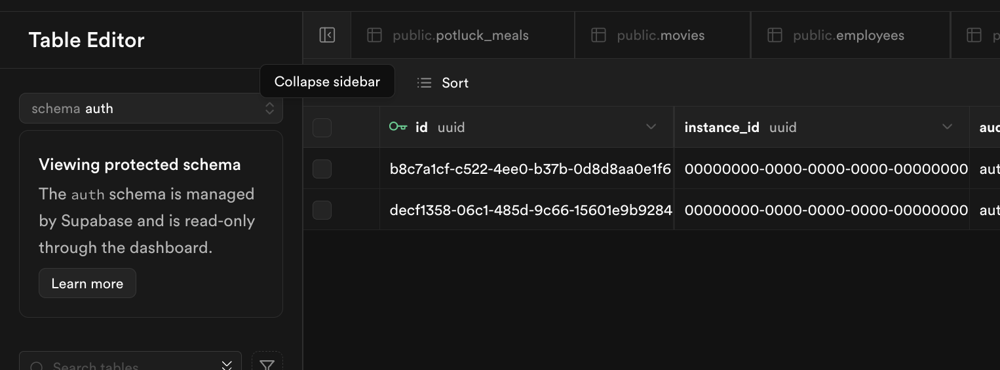

# React + Supabase Demo

This educational project demonstrates how to integrate Supabase with a React application. The project showcases common database operations and authentication features using Supabase as a backend service.

## Project Overview

This is a step-by-step tutorial project that shows how to:
1. Set up a React project with Supabase
2. Configure environment variables for Supabase credentials
3. Create and handle forms in React
4. Perform CRUD operations with Supabase
5. Manage employee data in a database

## Getting Started

### Prerequisites
- Node.js (Latest LTS version recommended)
- npm or yarn
- A Supabase account and project

### Getting Started

1. First create your database and add a table called potluck_meals. The table should meals for a potluck. Use columns like "meal_name", "guest_name", "serves", "kind_of_dish" with examples like "Meatloaf", "Bill", 7, "entree" for a meatloaf brought by Bill that serves 7 people.

2. Next create at least 3 meals to bring in Supabase. [example screenshot](./docs/00-screenshot-list-meals-db-table.png)

3. Set RLS Policy for your table to allow "read access for all users"

4. Next, Create a component for PotluckMeals that shows all the dishes that your guests will bring. This will be imported into your App.jsx file and displayed there. [example screenshot](./docs/01-screenshot-list-meals.png)

5. Next, Create a form for a new meal, and insert an object into your database. 
    * add the form [example screenshot](./docs/02-screenshot-form.png)
    * add the event listener
    * add a custom RLS Policy to allow inserts from public [example screenshot](./docs/03-screenshot-custom-rls-policy.png) [potential error](./docs/04-screenshot-potential-rls-error.png)
    * insert the meal and verify in supabase [example screenshot](./docs/05-screenshot-verify-insert.png)
    * Update the list with a select statement [example screenshot](./docs/06-display-meals-after-submit.png)
    * clear the inputs after submit [example screenshot](./docs/07-screenshot-clear-inputs.png)

6. Bonus Challenge: use option/select tags for the enumerated kinds of dish: (entree, side, snack, etc...)

7. Create another table and component for Beverages. Follow a similar pattern from the Meals

8. Create another table and component for Utensils (paper plates, plastic cups, etc...). Decide on the columns yourself.

9. Bonus Challenge: Create another table that you think would improve your app. Decide on the columns yourself.

10. Style your app. Optionally use Bootstrap.

11. Bonus Challenge: use conditional styling in your app.

12. Bonus Challenge: use something other than list item tags for your items. Get creative!

13. Bonus Challenge: break this up app into several more components with props.

14. Extra Bonus Challenge: have an option to upload a file. Consider using Cloudinary and an "upload url". This will take some research.

15. Add a Readme, and comment your code.

Choose at least 2 challenges to complete.

Be sure to commit after each step.

## Adding Users

### Adding a user to Supabase manually

Navigate to Authentication and then click "Add user" to add a Supabase user.



### Adding a user_id column to your table.

You must add a column with a Foreign Key to your table to "relate" the table to your user.

* For the column name choose "user_id"
* For the type choose `uuid`
* Click "Add foreign key" and find the table we need to relate to.
    * Select the schema "auth"
    * Select the "users" table
    * Select the column "id"
    * Optionally, select "Cascade" for "Action if referenced row is removed" to delete the row if the user is deleted.






### Login in your user...

View the docs for login in a user [here](https://supabase.com/docs/reference/javascript/auth-signinwithpassword).

Save the user object in state. You will need it to access things like

* `user.email`
* `user.id`
* `user.user_metadata`

### Creating a row with a user_id

To associate a row in your database to a user, simple include the user_id when you insert a new row.

```javascript
        const newMeal = {
            meal_name: mealName,
            guest_name: guestName,
            serves: serves,
            kind_of_dish: kindOfDish,
            user_id: user.id /* include your user.id if you have one */
        }
        console.log(newMeal)
        await supabase.from("potluck_meals").insert(newMeal)
```

### Selecting only your user's data

Add a filter on `user_id` to only get your user's.

```javascript
    const response = await supabase.from("potluck_meals").select().eq("user_id", user.id);
```

### Optionally update your RLS Policy 

Update your RLS Policy to only allow authenticated users to insert rows.



### Viewing your auth.users table

You can view your user table by selecting the auth schema, user table. But you can't edit this table. It is managed by Supabase.








### Adding a user_id to your table.

---

## Login Examples (Optional)

For examples of implementing user authentication:

- **Simple Logins**: See the [`logins`](https://github.com/rmccrear/practice-with-db/tree/logins) branch for a basic login implementation
- **Login Component with Callbacks**: See the [`login-component`](https://github.com/rmccrear/practice-with-db/tree/login-component) branch for a reusable login component that uses callback functions as props

